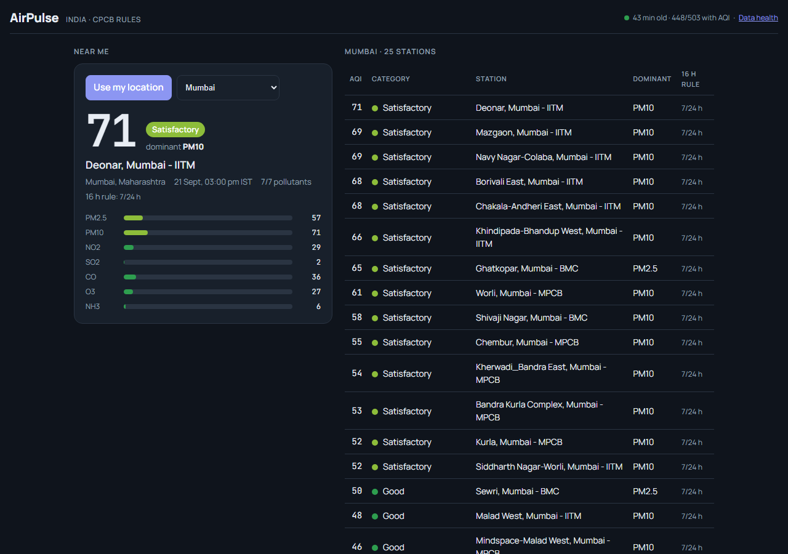
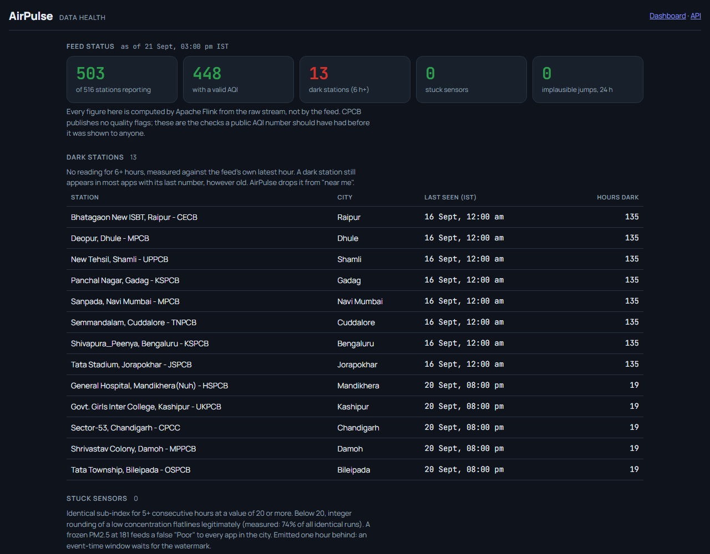

# AirPulse — real-time air quality intelligence for India


**Live dashboard:** _coming — see [DEPLOY.md](DEPLOY.md)_ · **API docs:** `/docs` on the same host

A streaming pipeline that ingests India's live government air-quality feed
(CPCB via data.gov.in), processes it with **Apache Flink**, and publishes a
per-station AQI that is *honest*: it says "insufficient data" instead of
inventing a number, tells you how far away the nearest monitor really is, and
flags frozen sensors and dead stations that every other app silently shows
as current.



## Architecture

```
                  ┌──────────────────────────── laptop / any Docker host ────────────────────────────┐
                  │                                                                                  │
 data.gov.in ───▶ │ producer ──▶ Redpanda (Kafka) ──▶ Apache Flink SQL, 4 jobs ──▶ Postgres (gold) │──▶ publisher ──▶ Neon Postgres
 CPCB, hourly     │ (Python)     aqi.readings.raw      ├ station AQI  (continuous GROUP BY)         │   (5 min)          │
 3,400 readings   │   │                                ├ completeness (24h HOP window, watermark)   │                    ▼
                  │   └─▶ validation sink ─▶ Postgres  ├ jumps        (LAG per station,pollutant)   │             Render: FastAPI
                  │       (bronze, 15 tests)  (bronze) └ stuck sensors(6h OVER window, RANGE frame) │             + PWA dashboard
                  └──────────────────────────────────────────────────────────────────────────────────┘
```

One `docker compose up -d --build` starts all nine containers, applies the
schema, and submits the Flink jobs. Nothing manual.

## What makes it different

| Problem with every AQI app | What AirPulse does | Where |
|---|---|---|
| Shows a number even when CPCB's own rules say there isn't one (need ≥3 pollutants incl. PM, 16 of 24 hours) | Applies the National AQI rules in the stream; emits **"insufficient data — fewer than 3 pollutants"** with the reason | `flink/sql/station_aqi.sql` |
| Presents a monitor 40 km away as "your air" (only ~12% of Indian cities have one) | Nearest-station lookup returns distance and a label: **representative** <5 km, **indicative** 5–25 km, **not covered** >25 km | `api/geo.py`, 16 tests |
| Keeps showing a station's last value after it goes dark | Dark-station detection (6 h, measured against the feed's own clock); dark stations are excluded from "near me" | `/api/quality` |
| Trusts a sensor frozen at PM2.5 = 181 for five hours | Stuck-sensor detection with a data-derived floor (74% of flat runs are low values that flatline legitimately) | `flink/sql/station_stuck.sql` |
| No idea whether the number is one hour old or one day old | Freshness in the header, "stale" when the pipeline is down — never a silent old value | `/api/health` |



## Streaming patterns, and why each one

The four Flink jobs deliberately use four different patterns, chosen per requirement:

| Job | Pattern | Why this one |
|---|---|---|
| Station AQI | Continuous `GROUP BY` with no window, upsert sink | The headline number must be low-latency. A late reading is just another update; the sink overwrites. |
| 24 h completeness | `HOP` window 24 h / 1 h on event time, watermark `ts − 30 min` | A health metric where being an hour late is fine but being wrong is not. Emits only once the watermark proves late data has been waited for. |
| Implausible jumps | `LAG` over `PARTITION BY (station, pollutant) ORDER BY ts` | Needs exactly the previous reading; row-at-a-time, cheap state. |
| Stuck sensors | `OVER` window, `RANGE BETWEEN INTERVAL '6' HOUR PRECEDING` | Needs the trailing history of each reading, one output per input. |

## Measured, not assumed

**Throughput** ([bench/](bench/README.md)): 260,064 messages (72 h × 516 stations) replayed through the production aggregation.

| JDBC sink flush | parallelism | Flink throughput | vs live feed |
|---|---|---|---|
| 100 rows (default) | 1 | 6,870 msg/s | 34,000× |
| 100 rows (default) | 4 | 7,930 msg/s | 40,000× |
| 2,000 rows / 2 s | 1 | 8,683 msg/s | 43,000× |
| **2,000 rows / 2 s** | **4** | **34,909 msg/s** | **175,000×** |

Parallelism alone gave +15%: the Postgres upsert sink was the bottleneck, not
the aggregation. Batching the sink made parallelism scale 4.4×. The tuning is
in production. Every run verified `gold rows == stations × hours`.

**The data** (from probing the feed, not the docs):

- The CPCB feed is a **mutating snapshot**, not a log: ~3,400 fixed slots overwritten hourly. Anything overwritten between polls is gone from the source forever — the poll interval is a data-loss boundary.
- Offset pagination over that snapshot **leaks**: 24–45 duplicates and as many misses per fetch. Idempotent producer + dedup in the sink + frequent polling self-heals.
- The feed publishes **sub-indices (0–500), not concentrations** — PM2.5 exceeds PM10 at ~20% of stations, impossible for concentrations. Validation ranges were rewritten when this was found.
- First run over 490 stations: 442 valid AQIs, **48 correctly rejected** (27 with <3 pollutants, 21 with no PM). A naive `MAX()` shows a number for all 48.
- **272 stuck sensors** (~8% of slots) in the first day, including PM2.5 frozen at 181 at IHBAS, Delhi. **15 stations dark** since the first day, still listed in the feed's metadata.

## Run it

Docker Desktop and a free [data.gov.in](https://data.gov.in/) API key (email signup, no card).

```bash
git clone https://github.com/gchinmay50-droid/airpulse && cd airpulse
cp .env.example .env               # paste DATAGOV_API_KEY
sh flink/download-jars.sh          # Kafka + JDBC connector JARs (not committed)
docker compose up -d --build       # everything: 9 containers, schema, 4 Flink jobs
```

| | URL |
|---|---|
| Dashboard | http://localhost:8010 |
| Data health | http://localhost:8010/health.html |
| API (OpenAPI) | http://localhost:8010/docs |
| Flink UI | http://localhost:8081 |
| Redpanda Console | http://localhost:8080 |

First data appears ~1 minute after start (the producer polls immediately);
completeness and stuck-sensor rows appear one hour later, when the watermark
passes the first hour — that delay is the event-time guarantee, not a bug.

```bash
python -m pytest tests/ -v         # 31 tests, no services needed (also runs in CI)
sh bench/run.sh 72 4               # throughput benchmark
docker compose --profile cloud up -d   # publish gold tables to a cloud DB (DEPLOY.md)
```

## Layout

```
src/        producer, validation rules, Postgres sink, load generator, gold publisher
flink/      Dockerfile (Flink 1.20 + connectors), sql/ (4 jobs), submit.sh (idempotent)
sql/        bronze + gold DDL, applied automatically on first start
api/        FastAPI (reads gold only), geo.py, static/ PWA
tests/      validation rules + geometry, pure functions
bench/      replay benchmark + results
explore/    the probes that produced the findings above
```

## Roadmap

- [x] Ingest, Kafka, validation sink, tests, CI
- [x] Flink: station AQI with sufficiency rules; 24 h completeness windows
- [x] Data-quality layer: stuck sensors, dark stations, implausible jumps, health page
- [x] Dashboard (FastAPI + PWA): city view, "AQI near me" with distance/confidence
- [x] Replay benchmark with measured numbers
- [x] Cloud deployment path (publisher + Render)
- [ ] Cross-source validation against OpenAQ concentrations
- [ ] GCP port: Pub/Sub + Cloud Run + BigQuery
